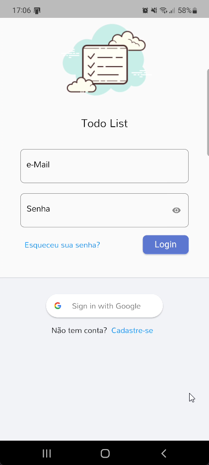
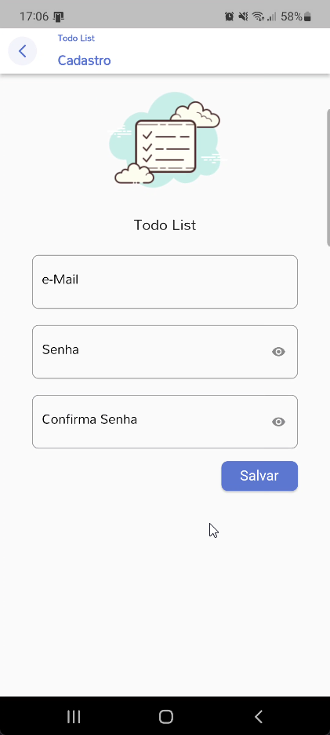
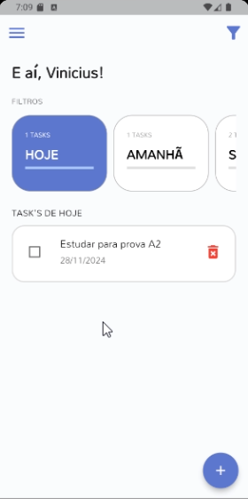
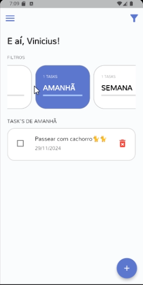
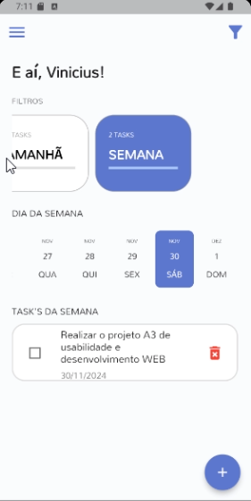
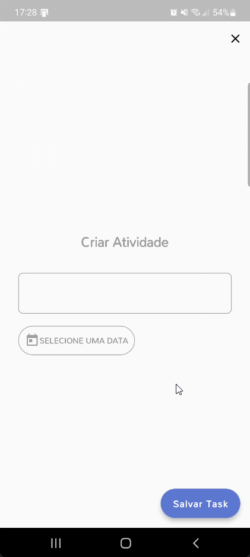
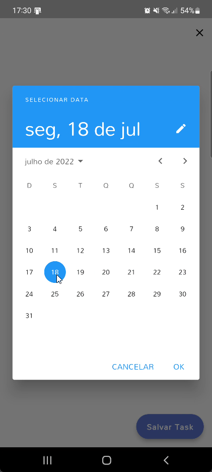
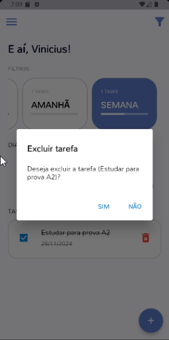
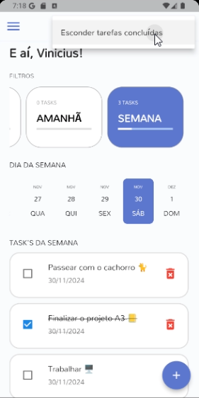

<!-- PROJECT LOGO -->
 

  

  <h3 align="center">Aplicativo Todo List </h3>

  

    Projeto de lista de tarefas criado para o projeto A3 de Usabilidade e Desenvolvimento WEB Mobile e Jogos. 
     
    

    <h2 align="left">Colaboradores: </h2>
    Vinicius Dantas Alverte Ferreira RA: 823219352  
    Gabriel Henrique de Santos Sousa RA: 12523218344  
    Lucas Henrique Rocha Lourenço RA: 323224861  
    Kevin Ottone Correia RA: 823217640  
    Carlos Eduardo Lopes Teixeira RA: 12523211856  
    

  

[Documento Projeto A3.pdf](https://github.com/user-attachments/files/17964589/Documento.Projeto.A3.pdf)

<!-- ABOUT THE PROJECT -->
## Sobre o projeto

&nbsp;&nbsp;&nbsp;&nbsp;&nbsp;&nbsp;
 
 

<!-- ABOUT THE PROJECT -->
## Sobre o projeto

Projeto de lista de tarefas criado no curso de Usabilidade e desenvolvimento WEB, em Dart e Flutter, que auxilia o usuário a criar e gerenciar suas tarefas do dia a dia. 

(<a href="#top">back to top</a>)

### Construído Utilizando

(<a href="#top">back to top</a>)

<!-- USAGE EXAMPLES -->
## Uso

O aplicativo permite o acesso através do cadastramento de usuário com e-mail e senha e também permite realizar a autenticação do usuário através da conta do Google.
 

&nbsp;&nbsp;&nbsp;&nbsp;&nbsp;&nbsp;

 
 

Ao acessar o aplicativo, serão exibidas as tarefas do Dia (Hoje) e também será possível visualizar as tafefas do dia seguinte (Amanhã) e da Semana.

&nbsp;&nbsp;&nbsp;&nbsp;&nbsp;&nbsp;

 
 

Caso não existam tarefas registradas o aplicativo apresentará uma mensagem informando.

&nbsp;&nbsp;&nbsp;

 
 

O usuário do sistema poderá a qualquer momento realizar a alteração do seu nome no aplicativo.

 
 

O usuário poderá criar suas tarefas informando o nome da mesma e a data da programada, bem como realizar a exclusão de uma tarefa registrada.

&nbsp;&nbsp;&nbsp;&nbsp;&nbsp;&nbsp;

 
 

Também é possível através do Menu Popup de Filtragem exibir ou ocultar as tarefas já finalizadas.

 
 

(<a href="#top">back to top</a>)

